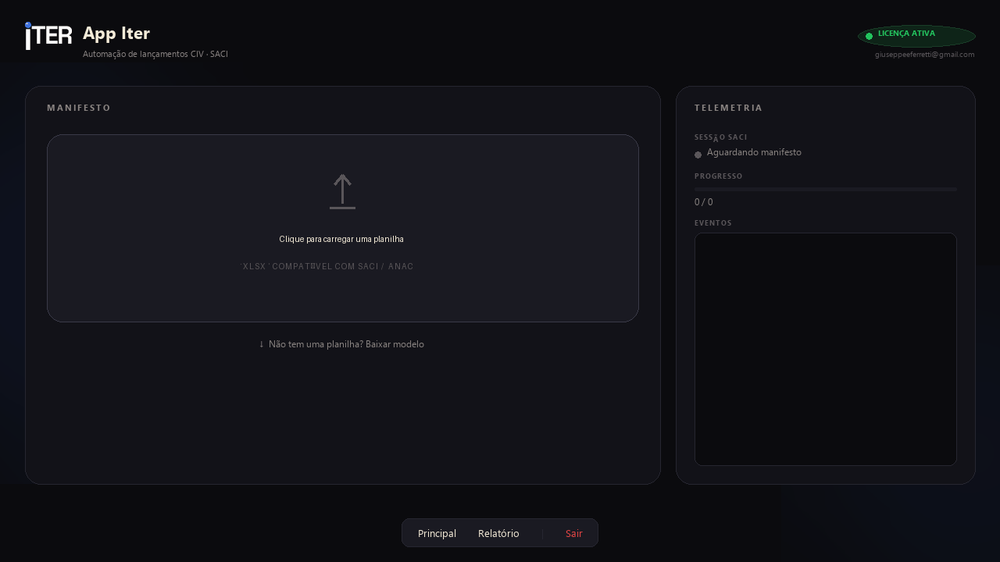

<p align="center"></p>

# App Iter — flight-log automation for Brazilian pilots

## 🇺🇸 English

**A paid Windows desktop product that bulk-imports pilot flight logbooks into SACI/CIV, the Brazilian civil-aviation authority (ANAC) portal — through the pilot's own logged-in browser.**

Brazilian pilots must log every flight field-by-field in a 2000s-era government portal. Heavy flyers lose 30–90 minutes a week to it, and there is no official bulk import. App Iter reads an Excel logbook and enters every flight automatically — **safely enough to run against government records**.

<p align="center"></p>

> 🔒 The product is commercial, so the source code is private. This repository documents the
> architecture and hosts the installer releases. Detailed case study: [portfolio.iterlabs.com.br](https://portfolio.iterlabs.com.br).

### Why it's technically interesting

- **CDP attach, not headless** — Playwright connects to the pilot's *own* already-logged-in browser via the Chrome DevTools Protocol. No embedded Chromium, no credential handling, and government SSO/2FA keeps working.
- **Idempotency by spreadsheet hashing** — every batch is fingerprinted before submission; re-running the same spreadsheet **never duplicates a government record**, even after a crash mid-batch.
- **Licensing without a backend server** — Supabase Auth (email OTP) + a `subscribers` table under RLS. An Asaas payment webhook hits a Deno Edge Function that activates the license — the whole commercial loop runs serverless.
- **Single-file distribution** — PyInstaller `--onedir` + Inno Setup produce one installer; public keys ship in the package by design, RLS protects the data.

### Architecture

```mermaid
flowchart LR
    subgraph Commercial loop
        P[Payment link<br/>Asaas] -->|webhook| EF[Supabase Edge Function<br/>Deno/TypeScript]
        EF -->|create user + upsert| DB[(subscribers<br/>RLS)]
    end
    subgraph Desktop app — Flet UI
        L[Email OTP login] --> DB
        X[Excel logbook] --> H[Batch hash<br/>idempotency]
        H --> B[civ_bot]
    end
    B -->|Playwright over CDP| BR[Pilot's own browser<br/>logged-in session]
    BR --> SACI[ANAC SACI/CIV portal]
```

### Stack

`Python` · `Flet (Flutter renderer)` · `Playwright / Chrome DevTools Protocol` · `Supabase (Auth, RLS, Edge Functions)` · `Asaas payments` · `PyInstaller + Inno Setup`

---

## 🇧🇷 Português

**Produto desktop pago (Windows) que importa cadernetas de voo em Excel direto no SACI/CIV da ANAC — pelo navegador já logado do próprio piloto.**

Pilotos brasileiros lançam cada voo campo a campo no portal do governo; quem voa muito perde de 30 a 90 minutos por semana. O App Iter lê a planilha e lança tudo automaticamente, com **idempotência por hash da planilha** (rodar de novo nunca duplica registro no governo), licenciamento por OTP + webhook de pagamento (Supabase + Asaas, 100% serverless) e automação via **CDP no navegador do próprio usuário** — sem Chromium embutido, sem guardar senha, SSO/2FA continuam funcionando.

> 🔒 Produto comercial: código-fonte privado. Este repositório documenta a arquitetura e
> hospeda os instaladores. Site do produto: <https://app-anac.vercel.app>

---

<sub>Built with AI-assisted development (Claude Code); designed, verified, and operated by <a href="https://github.com/giuseppeferretti">Giuseppe Ferretti</a> · <a href="https://portfolio.iterlabs.com.br">Iter Labs</a></sub>
